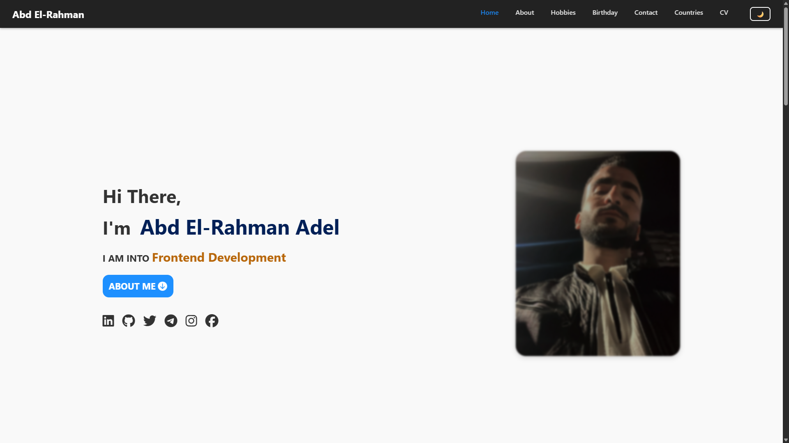
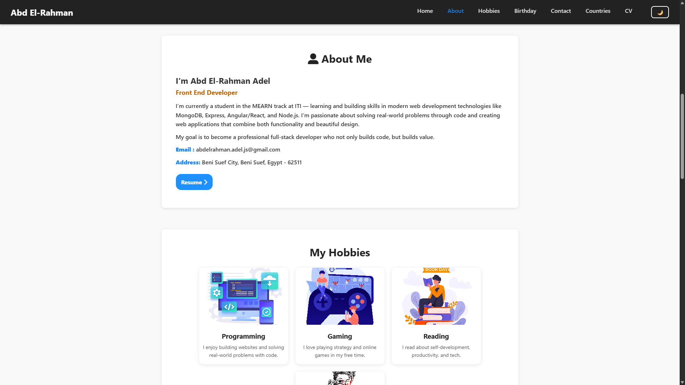
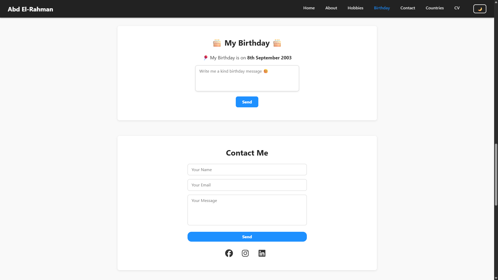
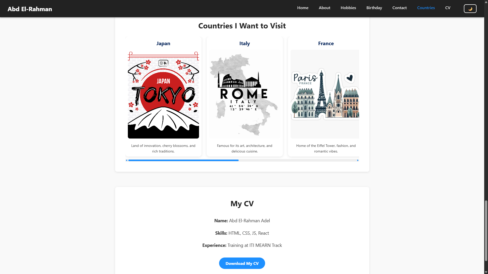

# 🌐 Personal Portfolio – Abd El-Rahman Adel

Welcome to my personal portfolio website — a responsive and clean design built with **HTML**, **CSS**, and **JavaScript**.  
Here, you can explore my background, skills, hobbies, and get in touch for collaboration or projects.

---

## 🔗 Live Demo

[🔴 View Live Website](https://abd-el-rahman-adel-dev.github.io/dev-portfolio/) <!-- ضع رابط الموقع بعد النشر -->

---

## 📁 Sections Overview

### 🏠 Home  
Intro with my name, title, and social links.

### 👤 About Me  
A section introducing who I am, what I study, and my future goals.

### 🧩 Hobbies  
Cards showing my favorite hobbies like Programming, Gaming, Reading, and Photography.

### 🎂 Birthday  
A birthday section with interactive message input.

### ✉️ Contact Me  
Simple contact form and social media icons.

### 🌍 Countries I Want to Visit  
A horizontal slider showing countries I wish to visit with brief captions.

### 📄 My CV  
Quick info about my skills, training, and a link to download my CV.

---

## 📷 Screenshots

| Section           | Preview                           |
|-------------------|---------------------------------|
| Home              |    |
| About & Hobbies   |    |
| Birthday & Contact|  |
| Countries & CV    |    |

---

## 🛠 Built With

- HTML5 (ES6+ features)  
- CSS3 (Flexbox, Grid)  
- JavaScript (Vanilla)  
- Font Awesome (for icons)

---

## 📦 How to Run Locally

To view or modify this project locally:

```bash
git clone https://github.com/abd-el-rahman-adel-dev/your-portfolio-repo.git
cd your-portfolio-repo
# Open index.html in your browser
```
---

## 🤝 Contributing
Contributions are welcome! Feel free to fork the repo, make changes, and open a pull request.

---

## 📬 Contact Me

- **LinkedIn:** [Abd El-Rahman Adel](https://www.linkedin.com/in/abd-el-rahman-adel-dev)  
- **GitHub:** [Abd El-Rahman Adel](https://github.com/abd-el-rahman-adel-dev)  
- **Email:** abdelrahman.adel.js@gmail.com

---

## 📄 License

This project is open-source and available under the **MIT License**.

---

## ⭐ If you like this project, please give it a star on GitHub!
